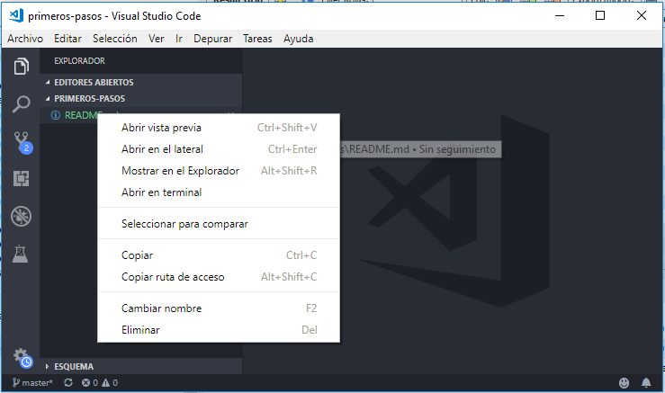

# Primeros pasos

Abrimos [Visual Studio Code](https://code.visualstudio.com/) en la carpeta `primeros-pasos` o usamos el siguiente comando:

```bash
cd 01-primeros-pasos
code .
```

Muchos de los comandos se requieren ejecutar mediante la terminal (o ventana de comandos), y [Visual Studio Code](https://code.visualstudio.com/) tiene un panel con una terminal integrada.

Para abrirla es necesario dar clic derecho en el panel de "Explorador" y seleccionar la opción "Abrir en terminal".



Una vez que la ventana de comandos está abierta, vamos a comenzar.

## Instalar Typescript

Vamos a instalar Typescript, y para ello usaremos el comando [`npm`](https://docs.npmjs.com/cli/install) que nos permitirá instalarlo.

```bash
npm init -y
npm install --save-dev typescript@2.9
```

Aquí es importante mencionar que usaremos la versión `2.9` para que este curso pueda funcionar igual en un futuro.

Todos los proyectos que usen NodeJS deben tener un archivo `package.json` para poder funcionar bien. En este momento usamos el comando `npm init -y` para crear uno nuevo. Si omitimos el modificador `-y` nos preguntará todas las opciones del archivo, pero como no lo necesitamos por el momento, pues usamos los predeterminados.

Una vez que hemos ejecutados los dos comandos, podemos observar que en la carpeta ahora hay un directorio llamado `package.json` y que esté ahora ya tiene una dependencia a Typescript.

```json
{
  "devDependencies": {
    "typescript": "^2.9.2"
  },
}
```

Otra cosa que podemos observar, es que ahora existe una carpeta llamada `node_modules`, es ahí donde se guarda Typescript, y todos los demás paquetes que vayamos instalando con el tiempo.

Algunos paquetes requieren de otros, y así esa carpeta se va llenando con muchos paquetes.

## Ejecutar Typescript

Anteriormente hablabamos de la carpeta `node_modules`, ahí es donde está Typescript; sin embargo no podríamos ejecutarlo sin antes agregar esa carpeta a la variable de sistema [PATH](https://superuser.com/questions/284342/what-are-path-and-other-environment-variables-and-how-can-i-set-or-use-them). Eso no es necesario por el momento.

Lo que es necesario es saber que de ahora en adelante, usaremos el comando `npx` antes de cualquier comando.

Ahora si, nuestro primer comando de Typescript.

```bash
npx tsc -v
```


Como podemos observar, el comando que en realidad estamos ejecutando es: 

 ```bash
tsc -v
 ```

Y es para obtener la versión de Typescript.

## Configurar Typescript

Antes de poder usar Typescript, debemos crear un archivo de configuración, este es llamado `tsconfig.json`

Ese archivo contiene varias configuraciones que iremos viendo conforme avancemos. Por el momento lo crearemos lo más sencillo posible.

Ejecutemos los siguientes comandos:

```bash
npx tsc --init
```

Ahora podremos obvervar un nuevo archivo llamado `tsconfig.json`, este viene con muchas opciones. 

Vamos a crear una carpeta llamada `src`, ahí es donde pondremos nuestro código. Recuerda que la carpeta se puede llamar como sea, aunque lo más común en este tipo de proyectos es usar ese nombre.

Puedes usar Visual Studio Code para crear la carpeta, o en la misma terminal con el siguiente comando:

```bash
mkdir src
```

Como siguiente paso, es abrir el archivo `tsconfig.json` para configurar la ruta.

Busca la opción `rootDir` y cambiala por `./src` que será nuestro nuevo directorio.

```
{
  "compilerOptions": {
    "rootDir": "./src"
  }
}
```

## Conclusión

Terminamos por ahora, como verás necesitas dos archivos básicamente, el `package.json` que instalará todas las herramientas necesarias, incluyendo Typescript, y el `tsconfig.json` donde pondremos la configuración necesaria para poder ejecutar nuestro código.

En el siguiente tema, veremos como [crear nuestro primer archivo](../02-primer-script) de Typescript.